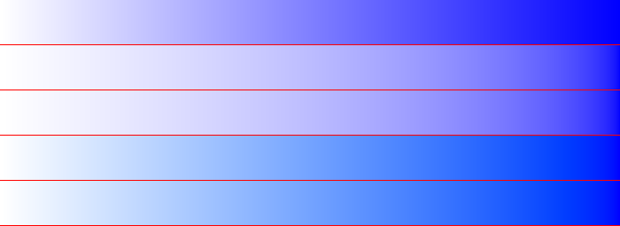
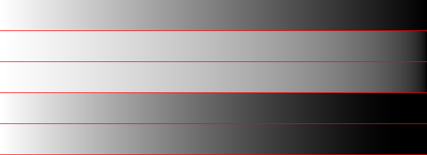

# colorspace
[](https://pkg.go.dev/github.com/soypat/colorspace)
[](https://goreportcard.com/report/github.com/soypat/colorspace)
[](https://codecov.io/gh/soypat/colorspace)
[](https://github.com/soypat/colorspace/actions/workflows/go.yml)
[](https://sourcegraph.com/github.com/soypat/colorspace?badge)

colorspace implements different color space logic to allow for conversion from colorspace to colorspace and interpolation within each colorspace.

How to install package with newer versions of Go (+1.16):
```sh
go mod download github.com/soypat/colorspace@latest
```

## Linear interpolation example
Shown in each image are 5 different color gradients generated with linear interpolation in each available colorspace. See [`examples/lerp`](./examples/lerp/lerp.go):
1. Topmost: **sRGB**. This is the naive linear interpolation
2. **Linear sRGB**. 
3. **CIE XYZ**
4. **OKLAB**
5. **OKLCH**. Designed to yield the most perceptively uniform gradient.




